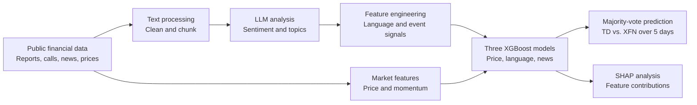

# AI-Driven Company & Stock Analysis — TD Bank

An end-to-end applied ML pipeline that converts public earnings calls, financial reports, and news into structured LLM-derived signals, then combines them with market features to model TD Bank's short-term performance relative to the Canadian financial sector.

**[View the case-study presentation (PDF)](./docs/presentation/summary-slide.pdf)**

## Project overview

Financial reports and earnings calls contain information that is difficult to represent with conventional market data alone. This project turns that unstructured text into measurable sentiment and topic features, then tests how those features contribute alongside price and news signals.

The analysis focuses on Toronto-Dominion Bank (`TD.TO`) and predicts whether it will outperform, underperform, or remain approximately neutral relative to the iShares S&P/TSX Capped Financials Index ETF (`XFN`) over the next five trading days.



## Highlights

- Annotated **3,884 passages** from earnings-call transcripts, regulatory filings, quarterly reports, and TD news releases.
- Extracted structured signals such as executive tone, analyst Q&A sentiment, topic prevalence, and differences between management language and formal filings.
- Traced TD's AML narrative from rising regulatory attention through the consent-order period and subsequent recovery signals.
- Combined price, language, and news models using a three-model XGBoost ensemble with walk-forward evaluation.
- Preserved source provenance and cached LLM annotations so the text-analysis stage is inspectable and does not require repeated API calls.

## What this project demonstrates

- Designing a structured LLM annotation workflow for domain-specific financial text
- Converting unstructured language into reusable numerical features
- Combining language, event, market, and news signals in a predictive pipeline
- Applying time-aware model evaluation to financial data
- Using SHAP to examine model behaviour and feature contributions
- Building reproducible batch-processing stages with cached intermediate outputs

## Reported results

The final system uses separate XGBoost models for price, language, and news signals, combined through hard majority vote.

| Model | Directional accuracy |
|---|---:|
| Price | 53.0% |
| Language | 55.0% |
| News | 53.6% |
| **Hard majority vote** | **56.6%** |
| Majority-class baseline | 50.3% |
| Momentum baseline | 51.1% |

Directional accuracy measures whether a non-neutral prediction correctly identifies the sign of TD's five-day excess return relative to XFN. These walk-forward results are exploratory evidence from a single-company case study, not a live trading-performance claim. Detailed model design, fold-level results, and limitations are documented in the [model card](./step3_predictive_model/final_model/docs/model_card.md).

## Repository guide

| Stage | Purpose | Start here |
|---|---|---|
| **1 — Data collection** | Collect public market and financial-document data, clean text, and create LLM-ready chunks | [Step 1 README](./step1_data_collection/README.md) |
| **2 — LLM analysis** | Annotate sentiment and topics, aggregate language features, and analyse the AML narrative | [Step 2 README](./step2_llm_analysis/README.md) |
| **3 — Predictive modelling** | Train the price, language, and news models; evaluate the ensemble; inspect SHAP results | [Step 3 README](./step3_predictive_model/README.md) |
| **Presentation** | Review the complete project as a visual case study | [Case-study deck](./docs/presentation/summary-slide.pdf) |

Each stage contains its own code, data products, documentation, and execution instructions. Earlier modelling experiments are retained under `step3_predictive_model/model_experiments_archive/`; the selected model is under `step3_predictive_model/final_model/`.

## Data-to-prediction workflow

1. **Collect public data** — daily prices, Bank of Canada macro series, TD earnings calls, regulatory filings, quarterly reports, and TD news releases.
2. **Prepare financial text** — clean documents, retain useful speaker and section context, and split the text into analysis-ready passages.
3. **Extract LLM signals** — assign structured sentiment scores and business-topic labels, with outputs cached by content hash.
4. **Build model features** — aggregate language signals by quarter and join them to rolling market and news features.
5. **Model and explain** — generate separate price, language, and news predictions, combine them by majority vote, and analyse feature contributions with SHAP.

Example language features include executive tone, analyst Q&A sentiment, the difference between transcript and filing language, AML topic share, credit-quality sentiment, guidance discussion, and rolling news sentiment.

## Key analytical finding

The language features make TD's AML enforcement cycle visible in the underlying documents. AML-related discussion increased substantially around the FY2024 Q4 consent-order period while AML sentiment deteriorated. Subsequent quarters showed changes in management-versus-filing framing and renewed emphasis on forward guidance. This illustrates how qualitative financial narratives can be converted into traceable signals before they enter a predictive model.

## Setup

```bash
python -m venv .venv
source .venv/bin/activate
pip install -r requirements.txt
```

Step 1 uses public sources and does not require an API key. To generate new annotations in Step 2, copy [`.env.example`](./.env.example) to `.env` and add an `OPENAI_API_KEY`, or provide the key through the shell environment. Cached annotations and derived feature tables are included for inspecting the existing analysis without repeating the LLM calls.

Execution commands and stage-specific requirements are documented in the three stage READMEs linked above.

## Limitations

- The analysis covers one company and should not be generalized to other firms without further testing.
- News features use TD newsroom releases rather than broad market-wide news coverage.
- The model predicts direction relative to XFN, not return magnitude or an investable trading strategy.
- The reported model performance should be interpreted as exploratory walk-forward evidence.
