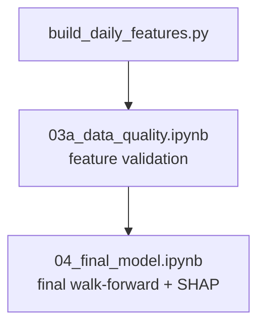

# Predictive Model Plan — TD Bank 5-Day Return

## Contents

- [1. Target Definition](#1-target-definition)
- [2. Included Data Sources](#2-included-data-sources)
- [3. Aggregation to Daily Grain](#3-aggregation-to-daily-grain)
- [4. NLP Feature Engineering](#4-nlp-feature-engineering)
- [5. Train / Test Split](#5-train--test-split)
- [6. Assumptions and Limitations](#6-assumptions-and-limitations)
- [7. Implementation Plan](#7-implementation-plan)
- [8. Feature Schema](#8-feature-schema)

---

## 1. Target Definition

For every trading day `d`, the target is:

```
target[d] = (adj_close[d+5] - adj_close[d]) / adj_close[d]
```

This is the **5-day forward return** of TD Bank (TD.TO): the percentage change between today's **dividend-adjusted** closing price and the adjusted closing price 5 trading days later (~1 calendar week). `adj_close` is used instead of raw `close` to strip out the mechanical price drops on TD's quarterly ex-dividend dates, ensuring the return series reflects only market-driven price movement.

### Concrete example

| Day `d` | TD close at `d` | TD close at `d+5` | target |
|---|---|---|---|
| Dec 4, 2024 | $77.20 | $74.50 | −3.5% |
| Dec 5, 2024 (consent order call) | $76.80 | $74.10 | −3.5% |
| Feb 26, 2025 (Q1'25 earnings eve) | $78.40 | $80.20 | +2.3% |

### Why 5 days, not 1 day

1-day returns are dominated by market microstructure noise (order flow, spread, intraday events). Our NLP features update once per quarter and capture **slow-moving narrative shifts**. A 5-day window is the shortest horizon where quarterly NLP features plausibly influence the return.

Concrete illustration: after the FY2024Q4 consent-order call (Dec 5, 2024), TD did not crash the next day — it drifted lower over the following 2–3 weeks. A 1-day model sees "CEO sentiment = 0.0 → next day nearly flat → NLP useless." A 5-day model captures the repricing.

### Why % return, not raw price

- Raw price is non-stationary: TD traded ~$55 in 2021 and ~$92 in 2026. A model trained on $55-range levels cannot generalise to $90+.
- % return is comparable across all years.
- Returns are what a trader cares about: "will holding TD for 5 days be profitable?"

### Dataset size after target construction

- ~1270 usable rows (trading days from Feb 25, 2021 — first NLP call date — to ~Apr 9, 2026, dropping the last 5 days where `d+5` is unknown)
- Each row = one trading day with its features and its 5-day forward return target

---

## 2. Included Data Sources

All sources are used up to their latest available date. There is no artificial cutoff at the FY2026Q1 call date (April 3, 2026) — price, macro, and news data after April 3 remain valid because FY2026Q1 NLP features forward-fill from that date. News data after FY2026Q1 is included in rolling window features.

| Source | File | Granularity | Last available |
|---|---|---|---|
| **TD price** | `data/raw/prices/TD_TO.parquet` | Daily | 2026-04-16 |
| **XFN** (financials sector ETF) | `data/raw/prices/XFN_TO.parquet` | Daily | 2026-04-16 |
| **GSPTSE** (TSX Composite) | `data/raw/prices/GSPTSE.parquet` | Daily | 2026-04-16 |
| **FX USD/CAD** | `data/raw/macro/fx_usdcad.parquet` | Daily | 2026-04-17 |
| **VIX** (CBOE Volatility Index) | `data/raw/macro/vix.parquet` | Daily | 2026-04-16 |
| **Gold** (spot price) | `data/raw/macro/gold.parquet` | Daily | 2026-04-16 |
| **DXY** (USD index) | `data/raw/macro/dxy.parquet` | Daily | 2026-04-16 |
| **BoC overnight rate** | `data/raw/macro/overnight_avg.parquet` | Daily | 2026-04-16 |
| **GoC 2-year yield** | `data/raw/macro/goc_2y.parquet` | Daily | 2026-04-16 |
| **GoC 5-year yield** | `data/raw/macro/goc_5y.parquet` | Daily | 2026-04-16 |
| **GoC 10-year yield** | `data/raw/macro/goc_10y.parquet` | Daily | 2026-04-16 |
| **CPI** | `data/raw/macro/cpi_all_items.parquet` | Monthly → forward-fill | 2026-02-01 |
| **NLP features** (transcripts + filings) | `data/processed/features/nlp_features.parquet` | Quarterly → forward-fill from call date | FY2026Q1 (call: 2026-04-03) |
| **News annotations** | `data/processed/llm_annotations/news.jsonl` | Event-driven → rolling windows | 2026-04-16 |

**Excluded:**
- Individual peer prices (RY, BMO, BNS, CM, NA) — redundant with XFN which is the sector basket
- `policy_target_rate` — near-identical to `overnight_avg`
- Raw open/high/low are not kept as direct model features. However, **adjusted** high and low (scaled by the same split/dividend factor as `adj_close`) are used internally to compute the `td_rsv_*` (Raw Stochastic Value) features in Group 1d, which require true intraday range data.

---

## 3. Aggregation to Daily Grain

### 3.1 Price features (TD, XFN, GSPTSE)

| Feature | Formula | Purpose |
|---|---|---|
| `td_return_1d` | `(adj_close[d] - adj_close[d-1]) / adj_close[d-1]` | Yesterday's momentum |
| `td_return_5d` | `(adj_close[d] - adj_close[d-5]) / adj_close[d-5]` | 1-week momentum |
| `td_return_20d` | `(adj_close[d] - adj_close[d-20]) / adj_close[d-20]` | 1-month momentum |
| `td_volatility_20d` | rolling 20-day std of `td_return_1d` | Risk regime |
| `td_volume_zscore_20d` | `(volume[d] - mean₂₀) / std₂₀` | Unusual trading activity |
| `td_vs_xfn_5d` | `td_return_5d - xfn_return_5d` | TD relative to financials sector |
| `td_vs_tsx_5d` | `td_return_5d - tsx_return_5d` | TD relative to broad market |
| `xfn_return_5d` | XFN 5-day return | Sector momentum |
| `tsx_return_5d` | TSX (GSPTSE) 5-day return | Broad market momentum |

### 3.2 FX (USD/CAD)

| Feature | Formula | Purpose |
|---|---|---|
| `fx_usdcad_level` | raw daily value | Exchange rate level |
| `fx_usdcad_return_5d` | 5-day % change | FX momentum |
| `fx_usdcad_volatility_20d` | rolling 20-day std of daily FX change | FX risk regime |

### 3.3 Interest rates and yields

| Feature | Formula | Purpose |
|---|---|---|
| `rate_overnight_level` | raw value | Current rate environment |
| `rate_overnight_change_5d` | `value[d] - value[d-5]` | Rate momentum |
| `yield_2y_level` | raw value | Short-rate expectations |
| `yield_5y_level` | raw value | Mortgage rate proxy |
| `yield_10y_level` | raw value | Long-end |
| `yield_curve_slope` | `yield_10y - yield_2y` | Curve steepness (key for bank NIM) |
| `yield_curve_slope_change_5d` | `slope[d] - slope[d-5]` | Curve momentum |

### 3.4 CPI — monthly, forward-fill to daily

| Feature | Formula | Purpose |
|---|---|---|
| `cpi_level` | latest known CPI value | Inflation level |
| `cpi_yoy_change` | `(cpi[d] - cpi[d-12m]) / cpi[d-12m]` | Year-over-year inflation |

### 3.5 NLP features — quarterly, project to daily via point-in-time

**Rule:** Use NLP features from the most recent earnings call date on or before day `d`. Forward-fill from call date to the next call date.

**Assumption:** The earnings call date is treated as the publication date for all disclosures in a quarter — transcript, quarterly supplemental report, and 40-F. Using the quarter end date as publication is not realistic (reports take weeks to finalise). The earnings call date is the earliest date at which all quarter-Q information is publicly available.

Earnings call dates derived from transcript data:

| Fiscal Quarter | Quarter ends | Call date (activation) |
|---|---|---|
| FY2021Q1 | 2021-01-31 | **2021-02-25** |
| FY2021Q2 | 2021-04-30 | **2021-05-27** |
| FY2021Q3 | 2021-07-31 | **2021-08-26** |
| FY2021Q4 | 2021-10-31 | **2021-12-02** |
| FY2022Q1 | 2022-01-31 | **2022-03-03** |
| FY2022Q2 | 2022-04-30 | **2022-05-26** |
| FY2022Q3 | 2022-07-31 | **2022-08-25** |
| FY2022Q4 | 2022-10-31 | **2022-12-01** |
| FY2023Q1 | 2023-01-31 | **2023-03-02** |
| FY2023Q2 | 2023-04-30 | **2023-05-26** |
| FY2023Q3 | 2023-07-31 | **2023-08-24** |
| FY2023Q4 | 2023-10-31 | **2023-11-30** |
| FY2024Q1 | 2024-01-31 | **2024-02-29** |
| FY2024Q2 | 2024-04-30 | **2024-05-23** |
| FY2024Q3 | 2024-07-31 | **2024-08-22** |
| FY2024Q4 | 2024-10-31 | **2024-12-05** |
| FY2025Q1 | 2025-01-31 | **2025-02-27** |
| FY2025Q2 | 2025-04-30 | **2025-05-22** |
| FY2025Q3 | 2025-07-31 | **2025-08-28** |
| FY2025Q4 | 2025-10-31 | **2025-12-04** |
| FY2026Q1 | 2026-01-31 | **2026-04-03** |

Days before the first call date (Feb 25, 2021) have no NLP features and are dropped from the model dataset.

### 3.6 News annotations — rolling daily windows

For each trading day `d`, compute generic rolling aggregates across **all** news chunks with `date <= d`. No topic pre-filtering — topic-level signal is already captured in NLP features (section 3.5). Cherry-picking topics like AML from news would introduce hindsight selection bias.

| Feature | Window | Purpose |
|---|---|---|
| `news_sent_mean_7d` | 7 days | Short-term news tone |
| `news_sent_mean_30d` | 30 days | Medium-term news tone |
| `news_count_7d` | 7 days | News activity level |
| `news_count_30d` | 30 days | News volume trend |
| `days_since_last_news` | — | News recency |

---

## 4. NLP Feature Engineering

Quarterly NLP features are constant for ~60 trading days between calls. Naive forward-fill produces flat features that tree models split on by date rather than signal content. Three transforms are applied to all 36 NLP source columns to encode information in useful ways.

**Guiding principle:** Apply transforms to **all** NLP columns uniformly — speaker sentiments, report sentiments, all 12 topic shares, all 12 topic sentiments, entropy, and derived framing gap. Do not pre-select columns based on Step 2 findings. Let SHAP determine importance post-hoc.

**NLP source columns (33 total):**
- Speaker (5): `ceo_prep`, `cfo_prep`, `exec_qa`, `analyst_qa` sentiment + `sentiment_std`
- Reports / news (2): `news_sentiment_mean`, `report_sentiment_mean` (combined quarterly + 40-F, keyed on call date)
- Topics (×12, = 24): `NIM`, `credit_quality`, `capital`, `US_retail`, `Canadian_personal`, `wealth_wholesale`, `regulatory_AML`, `macro_outlook`, `cost_efficiency`, `guidance`, `M_and_A`, `other` — each with `_share` and `_sentiment`
- `topic_entropy` (1)
- Derived (1): `framing_gap` = `ceo_prep_sentiment - report_sentiment_mean`

### 4.1 Level (forward-fill)

Current state of each signal, constant within each inter-call window.

```
{col}_ffill  =  most recent quarter value, forward-filled from call date
```

### 4.2 Delta (publication shock)

Change from the prior quarter. Captures the magnitude of the shift at publication — e.g. CEO sentiment dropping sharply, a topic share spiking. Different constant per window.

```
{col}_delta  =  value[current quarter] − value[previous quarter]
```

### 4.3 Surprise (deviation from baseline)

How unusual is the current value relative to the trailing 4-quarter mean? Normalises across different baseline levels so the model can compare signals across columns.

```
{col}_surprise  =  value[current quarter] − mean(value, trailing 4 quarters)
```

### 4.4 Recency

| Feature | Formula |
|---|---|
| `days_since_call` | trading day `d` − most recent call date (resets to 0 on each new call) |

### 4.5 Event flags

| Feature | Definition |
|---|---|
| `is_earnings_week` | 1 if `days_since_call <= 5` |
| `is_news_burst` | 1 if `news_count_7d > 10` |

**Total NLP-derived features:** 33 columns × 3 transforms (level, delta, surprise) = **99 features** (plus 8 news/event features in Section 3.6)

---

## 5. Train / Test Split

### Why time-based split, not random k-fold

Financial time-series data has two properties that make random splitting invalid:

1. **Temporal ordering**: the model must only use information available at the time of prediction. A random split would put future observations in the training set — this is look-ahead leakage.
2. **Overlapping targets**: consecutive 5-day forward returns share 4 of the same future prices (days `d` and `d+1` both reference closes at `d+2`, `d+3`, `d+4`, `d+5`, `d+6`). A random split that puts `d` in training and `d+1` in test effectively leaks the target.

### Expanding-window walk-forward validation (7 folds)

The model uses an **expanding-window walk-forward** setup (`ROLL_EX` in Qlib terminology): training always starts at the dataset origin (`2021-02-25`) and expands to a fold cutoff date, while each test window covers the following 6 months. This mirrors how the model would operate in production — each retrain adds newly observed data without discarding historical context.

```
Fold 1:  Train: 2021-02-25 → 2022-12-30  |  Test: 2023-01-10 → 2023-06-30
Fold 2:  Train: 2021-02-25 → 2023-06-30  |  Test: 2023-07-11 → 2023-12-29
Fold 3:  Train: 2021-02-25 → 2023-12-29  |  Test: 2024-01-09 → 2024-06-28
Fold 4:  Train: 2021-02-25 → 2024-06-28  |  Test: 2024-07-09 → 2024-12-31
Fold 5:  Train: 2021-02-25 → 2024-12-31  |  Test: 2025-01-09 → 2025-06-30
Fold 6:  Train: 2021-02-25 → 2025-06-30  |  Test: 2025-07-09 → 2025-12-31
Fold 7:  Train: 2021-02-25 → 2025-12-31  |  Test: 2026-01-09 → 2026-04-09
```

**Three design choices to ensure honest evaluation:**

1. **5-row boundary gap (leakage prevention):** The first 5 rows after each fold cutoff are excluded from the test set. Since the target `td_return_5d_fwd` at cutoff day `d` uses prices up to `d+5`, rows immediately after the cutoff share price observations with the last training rows. Dropping 5 rows eliminates this boundary overlap entirely.

2. **Stride-5 evaluation (independent observations):** Directional accuracy is computed on every 5th test row only (rows 0, 5, 10, …). Consecutive 5-day return targets share overlapping price paths — the return from day `d` to `d+5` and from `d+1` to `d+6` share 4 of the same intermediate prices. Evaluating on every 5th row gives approximately independent observations (~23–25 per fold), preventing autocorrelated observations from inflating confidence in the metric. Training still uses all rows.

3. **NLP timing verified at fold boundaries:** NLP features in the feature matrix activate on earnings call dates (not calendar quarter ends). TD Bank reports in early December (Q4) and late May (Q2), placing each earnings call 26–39 days before the Jun 30 / Dec 31 fold boundaries. This means every fold's training ends with the most recent call's NLP signal already incorporated, and the next call always falls cleanly inside the test window — no future NLP data bleeds into training.

### Per-fold performance (LightGBM, 169 features)

Evaluation: **offset-averaged stride-5** — DirAcc for each fold is the mean of stride-5 evaluations at all 5 offsets (0–4). A **95% CI** is derived using a t-distribution (df = 4) over the 5 offset estimates. See `notebooks/04_final_model.ipynb` for the locked execution.

| Fold | Train rows | Test rows | DirAcc | 95% CI | IC | Notes |
|---|---|---|---|---|---|---|
| v1 — 23H1 | 464 | 121 | 46.2% | ±6.9% | +0.135 | Post-AML-announcement; TD drifts lower with whipsaw noise |
| v2 — 23H2 | 590 | 119 | 47.9% | ±11.3% | −0.045 | Whipsaw regime (+4% → −5% → +7% monthly reversals) |
| v3 — 24H1 | 714 | 121 | 51.2% | ±11.2% | +0.072 | Steady AML-pressure downtrend; momentum features partially align |
| v4 — 24H2 | 840 | 121 | 57.5% | ±12.2% | +0.189* | AML settlement repricing; stable macro environment |
| v5 — 25H1 | 966 | 120 | 47.1% | ±7.7% | +0.215* | Post-settlement recovery rally; consistent but wrong-direction signal |
| v6 — 25H2 | 1,091 | 121 | 64.5% | ±8.6% | −0.236* | Low-volatility consolidation; strong binary direction, weak rank ordering |
| v7 — 26Q1 | 1,217 | 63 | 55.6% | ±7.4% | +0.088 | Tariff shock; macro fear features partially offset novel regime |
| **Mean** | **840** | | **52.9%** | **±9.3%** | **+0.060** | Consistent with rigorous academic benchmark range (52–58%); * = p < 0.05 |

---

## 6. Assumptions and Limitations

- **Real-time pipeline assumption**: The model assumes an end-of-day pipeline exists — collecting today's news, closing prices, and macro data, then running inference to produce the 5-day forward prediction. This analysis uses a static historical dataset and does not implement live inference. Building such a pipeline would require integration with live data vendors.

- **Small NLP sample**: only 21 quarterly NLP snapshots across 5 years. The model sees only ~21 distinct NLP regime values per column. SHAP feature attribution is more informative than point predictions here.

- **No intra-quarter NLP updates**: between earnings calls, all NLP level features are constant (~60 trading days). News rolling features partially compensate.

- **Report date approximation**: Quarterly reports and 40-F filings are stored with quarter end dates, which is not realistic. We use the earnings call date as the uniform publication date for all disclosures (transcript, quarterly report, 40-F). This is the earliest date at which all quarter information is publicly available.

- **CPI lag**: CPI for month M is released mid-month M+1. We forward-fill from the first of the month as a proxy, slightly overstating availability.

- **Overlapping target autocorrelation**: consecutive 5-day returns share 4 days of the same future window. A single time-based split avoids leakage but does not eliminate autocorrelation in residuals. Reported metrics (R², directional accuracy) should be interpreted conservatively.

- **Missing value handling — zero fill at source, no model-level imputation**: All missing values are resolved in the feature builder before the model sees the data.
  - `cpi_yoy_change` — fixed by extending CPI data back to 2020-01-01, enabling an exact 12-month `pct_change(12)` at monthly grain before forward-filling to daily. Zero missing values remain.
  - Delta / surprise columns for FY2021Q1 window — filled with **−9999** (sentinel value). The FY2021Q1 window (Feb 25 – May 26, 2021) is kept in the dataset but has no prior quarter, so delta and surprise are genuinely unknown. −9999 is far outside the natural feature range (sentiment: 0–1, topic shares: 0–1), so tree models learn a dedicated split for "this feature was unavailable" rather than conflating it with a real value. Using 0 would be misleading (0 implies "no change"), and dropping the rows loses 63 training observations without clear benefit.
  - `news_sent_mean_7d` and `news_sent_mean_30d` — filled with **0** on days when no news articles were published in the trailing window. Zero is semantically correct: no news = no sentiment signal, not an unknown to be estimated from other days.

- **No transaction costs**: model evaluates return predictability only, not a live trading strategy. Positive accuracy does not imply tradeable alpha after costs.

---

## 7. Implementation Plan

### Files built

| File | Purpose |
|---|---|
| `src/features/build_daily_features.py` | Join all sources; apply all transforms; output `data/processed/features/model_features_daily.parquet` |
| `src/models/baseline.py` | Initial Random Forest baselines (Options A and C) — superseded by LightGBM walk-forward |
| `notebooks/03_modeling.ipynb` | LightGBM walk-forward validation, SHAP feature importance, fold analysis |
| `notebooks/03a_data_quality.ipynb` | Feature quality checks: null rates, date coverage, distribution validation |
| `notebooks/04_final_model.ipynb` | **Final locked model** — walk-forward execution, SHAP analysis, per-fold commentary |
| `docs/step3_modeling/model_experiments.md` | Full chronological experiment log (E1–E25) with per-fold results |

### Build order



### Expanding-window training strategy

The model uses **ROLL_EX (expanding window)** — training always starts from the dataset origin (`2021-02-25`) and grows with each fold. This mirrors production deployment: every 6 months, the model is retrained on all available history to date.

```
Fold 1: Train [Feb 2021 → Dec 2022]  →  Test [Jan 2023 → Jun 2023]
Fold 2: Train [Feb 2021 → Jun 2023]  →  Test [Jul 2023 → Dec 2023]
Fold 3: Train [Feb 2021 → Dec 2023]  →  Test [Jan 2024 → Jun 2024]
         ↑ Training window grows by 6 months per fold
```

**Why expanding over sliding:** With only ~1,285 rows for a single stock, sliding windows (fixed lookback) sacrifice too many historical observations. In experiments (E23), a 2-year sliding window averaged only 499 training rows per fold — just 3 rows per feature — at the boundary of reliable tree learning. The expanding window retains all historical context while naturally up-weighting recent data through the NLP delta/surprise transforms, which encode change relative to trailing history.

**Sample weighting:** All training rows receive equal weight. No explicit exponential decay is applied. The NLP `_delta` and `_surprise` features serve an implicit recency role: they encode how the current quarter deviates from the trailing 4-quarter mean, making recent regime shifts visible to the model without needing temporal weighting of individual rows.

### Data leakage audit (verified 2026-04-19)

A comprehensive point-in-time audit was conducted and all checks passed:

| Check | Result |
|---|---|
| Target `td_return_5d_fwd` | ✓ Verified to use `adj_close[d+5]` — recomputation error < 1e-15 |
| Price/volume features | ✓ All backward-looking; verified against raw price files |
| Macro/rates/FX/VIX/Gold/DXY | ✓ All non-null, daily forward-fill from contemporaneous sources |
| NLP features | ✓ Activate on earnings call date only; no future quarter leaks |
| NLP at fold boundaries | ✓ Last call always 26–39 days before each fold cutoff; next call always in test |
| News rolling windows | ✓ 7-day inclusive lookback verified at 3 spot dates |
| Forward-looking column names | ✓ None detected in 169-feature set |

### Current model configuration

| Component | Setting |
|---|---|
| Model | LightGBM (`num_leaves=31`, `lr=0.03`, `feature_fraction=0.3`, `min_child_samples=20`, `λ₁=0.5`, `λ₂=1.0`, `n_estimators=300`) |
| Validation | ROLL_EX expanding window, 7 folds, 6-month test windows |
| Boundary gap | 5 rows dropped after each fold cutoff |
| Evaluation | Stride-5 (independent observations), no threshold filter |
| NLP missingness | NaN passed natively to LightGBM (no sentinel at model layer) |
| Sample weights | Equal (no temporal decay) |
| Mean DirAcc | **52.9%** across 7 out-of-sample folds — offset-averaged stride-5 (locked notebook `04_final_model.ipynb`) |

### Output dataset shape

- Rows: 1,285 trading days (2021-02-25 → 2026-04-09)
- Features: 12 price/momentum + 6 volume + 3 mean-reversion + 20 Qlib Alpha158 + 3 FX + 7 rates + 2 CPI + 9 external fear + 99 NLP-engineered + 8 news/events = **169 features**
- Target: `td_return_5d_fwd` (continuous, regression)

---

## 8. Feature Schema

> **Note:** Schema reflects the current `model_features_daily.parquet` (169 features). Groups 1c, 1d, and 4b were added after the initial MVP and are not described in the original Sections 3–4. Qlib attribution noted where applicable.

### Target

| Column | Type | Description |
|---|---|---|
| `td_return_5d_fwd` | float | `(adj_close[d+5] - adj_close[d]) / adj_close[d]` — 5-day forward **adjusted** return of TD.TO. Prediction target. |

### Group 1a: Price & Momentum (12 columns)

| Column | Description |
|---|---|
| `td_return_1d` | TD 1-day **backward** return: `(close[d] - close[d-1]) / close[d-1]` — yesterday's momentum |
| `td_return_5d` | TD 5-day **backward** return: `(close[d] - close[d-5]) / close[d-5]` — past-week momentum. Note: the prediction target `td_return_5d_fwd` is the same formula but forward-looking (`d+5`). |
| `td_return_20d` | TD 20-day **backward** return — past-month momentum |
| `xfn_return_1d` | XFN (Canadian financials ETF) 1-day return |
| `xfn_return_5d` | XFN 5-day return |
| `xfn_return_20d` | XFN 20-day return |
| `tsx_return_1d` | TSX Composite (GSPTSE) 1-day return |
| `tsx_return_5d` | TSX 5-day return |
| `tsx_return_20d` | TSX 20-day return |
| `td_volatility_20d` | Rolling 20-day std of TD daily returns — risk regime indicator |
| `td_vs_xfn_5d` | TD 5-day return minus XFN 5-day return — TD relative to sector |
| `td_vs_tsx_5d` | TD 5-day return minus TSX 5-day return — TD relative to broad market |

### Group 1b: Volume (6 columns)

| Column | Description |
|---|---|
| `td_volume_zscore_20d` | TD volume z-score vs 20-day rolling mean — is today's TD volume unusually high or low? |
| `td_volume_change_1d` | Day-over-day pct change in TD volume — immediate interest acceleration |
| `td_volume_change_5d` | 5-day rolling avg TD volume vs prior 5-day avg — weekly volume trend |
| `td_volume_change_20d` | 20-day rolling avg TD volume vs prior 20-day avg — monthly institutional interest drift |
| `xfn_volume_zscore_20d` | XFN volume z-score vs 20-day mean — unusual activity in Canadian financials sector |
| `tsx_volume_zscore_20d` | TSX Composite volume z-score vs 20-day mean — broad market activity level |

### Group 1c: Mean-Reversion (3 columns)

Standard technical analysis indicators that capture how far price has stretched from an equilibrium level. Complement momentum features by giving the model a signal for over-extended moves.

| Column | Description |
|---|---|
| `td_rsi_14` | Relative Strength Index (14-day): ranges 0–100; >70 = overbought, <30 = oversold |
| `td_bb_position` | Bollinger Band position: `(close - lower_band) / (upper_band - lower_band)`, 0–1; <0.2 = near lower band (oversold) |
| `td_dist_52w_high` | Distance from 52-week high: `(close - high_252d) / high_252d`; negative value = how far below recent peak |

### Group 1d: Qlib Alpha158 Factors (20 columns)

> **Source:** Derived from the [Microsoft Qlib](https://github.com/microsoft/qlib) Alpha158 factor library. Formulas corrected to use Qlib's bounded/normalised definitions (SUMD, CNTD bounded to [−1, +1]; WVMA as coefficient of variation; RSV using true intraday high/low range).

Advanced price-volume interaction and regression-based factors used in quantitative research. These capture market microstructure signals not visible in simple return or volume features.

| Column | Description |
|---|---|
| `td_corr_pv_5d` | 5-day Pearson correlation between daily close price and volume — positive = price and volume move together (trend confirmation) |
| `td_corr_pv_20d` | 20-day price-volume correlation |
| `td_wvma_5d` | 5-day weighted volume moving average: coefficient of variation of volume-weighted prices — measures price dispersion relative to volume |
| `td_wvma_20d` | 20-day WVMA |
| `td_cntd_5d` | 5-day count directional signal: `(up_days − down_days) / window`, bounded [−1, +1] — net directional agreement over the window |
| `td_cntd_20d` | 20-day CNTD |
| `td_sumd_5d` | 5-day sum directional signal: normalised sum of signed returns, bounded [−1, +1] — signed momentum with magnitude capped |
| `td_sumd_20d` | 20-day SUMD |
| `td_rsv_5d` | 5-day Raw Stochastic Value: `(close − min_low) / (max_high − min_low)` using true intraday high/low — 0 = at period low, 1 = at period high |
| `td_rsv_14d` | 14-day RSV (standard stochastic window) |
| `td_rsv_20d` | 20-day RSV |
| `td_beta_5d` | 5-day beta of TD vs TSX Composite — short-term market sensitivity |
| `td_rsqr_5d` | 5-day R² of TD vs TSX regression — how much of TD's move is explained by the market |
| `td_resi_5d` | 5-day regression residual — TD's idiosyncratic return after removing market component |
| `td_beta_20d` | 20-day beta vs TSX |
| `td_rsqr_20d` | 20-day R² vs TSX |
| `td_resi_20d` | 20-day idiosyncratic residual |
| `td_beta_60d` | 60-day beta vs TSX — longer-term market sensitivity (captures regime-level correlation changes) |
| `td_rsqr_60d` | 60-day R² vs TSX |
| `td_resi_60d` | 60-day idiosyncratic residual |

### Group 2: FX (3 columns)

| Column | Description |
|---|---|
| `fx_usdcad_level` | USD/CAD exchange rate level — relevant for TD's US operations |
| `fx_usdcad_return_5d` | USD/CAD 5-day pct change — FX momentum |
| `fx_usdcad_volatility_20d` | Rolling 20-day std of daily FX changes — currency risk regime |

### Group 3: Interest Rates & Yields (7 columns)

| Column | Description |
|---|---|
| `rate_overnight_level` | BoC overnight rate level — key driver of bank net interest margin (NIM) |
| `rate_overnight_change_5d` | 5-day change in overnight rate — rate momentum |
| `yield_2y_level` | GoC 2-year benchmark yield — short-rate expectations |
| `yield_5y_level` | GoC 5-year benchmark yield — mortgage rate proxy |
| `yield_10y_level` | GoC 10-year benchmark yield — long-end of curve |
| `yield_curve_slope` | `yield_10y - yield_2y` — yield curve steepness; flat/inverted curve pressures NIM |
| `yield_curve_slope_change_5d` | 5-day change in curve slope — curve momentum |

### Group 4: CPI (2 columns)

| Column | Description |
|---|---|
| `cpi_level` | Latest known CPI all-items level (monthly, forward-filled to daily) |
| `cpi_yoy_change` | Year-over-year CPI pct change (computed at monthly grain, forward-filled) |

### Group 4b: External Fear / Macro Sentiment (9 columns)

Three global risk-off indicators added to capture macro fear regimes that the domestic rate and CPI features cannot represent. These are particularly relevant for TD given its large US retail operation and the USD/CAD transmission channel.

| Column | Description |
|---|---|
| `vix_level` | CBOE VIX index level — implied volatility of S&P 500 options; >30 = elevated fear, >40 = crisis |
| `vix_return_5d` | 5-day % change in VIX — spike signals sudden fear onset (e.g. tariff shock Jan 2026) |
| `vix_volatility_20d` | 20-day rolling std of daily VIX changes — persistent uncertainty vs brief spikes |
| `gold_level` | Gold spot price level — safe-haven demand proxy |
| `gold_return_5d` | 5-day gold return — rapid safe-haven flows |
| `gold_volatility_20d` | 20-day gold volatility |
| `dxy_level` | USD index (DXY) level — broad USD strength; strong USD = headwind for TD's CAD-reported US earnings |
| `dxy_return_5d` | 5-day DXY return — USD momentum |
| `dxy_volatility_20d` | 20-day DXY volatility — currency risk regime |

### Group 5: NLP — Level / `_ffill` (33 columns)

Forward-filled from the earnings call date of each fiscal quarter. **Constant within each inter-call window (~60 trading days)** — every trading day between two calls carries the same value. Activated on call date, not quarter end. `days_since_call` (Group 8) measures how stale the snapshot is on any given day.

| Column | Description |
|---|---|
| `transcript_ceo_prep_sentiment_mean_ffill` | Mean sentiment of CEO prepared remarks — scripted tone at publication |
| `transcript_cfo_prep_sentiment_mean_ffill` | Mean sentiment of CFO prepared remarks |
| `transcript_exec_qa_sentiment_mean_ffill` | Mean sentiment of all executives during analyst Q&A |
| `transcript_analyst_qa_sentiment_mean_ffill` | Mean sentiment of analyst questions — proxy for market skepticism |
| `transcript_sentiment_std_ffill` | Std deviation of chunk sentiments within the call — tone consistency |
| `news_sentiment_mean_ffill` | Mean sentiment of TD press releases in that fiscal quarter |
| `report_sentiment_mean_ffill` | Mean sentiment of quarterly supplemental report (Q1–Q3) or 40-F (Q4) |
| `topic_NIM_share_ffill` | Share of discussion chunks tagged to net interest margin topic |
| `topic_NIM_sentiment_ffill` | Mean sentiment of NIM-tagged chunks |
| `topic_credit_quality_share_ffill` | Share of chunks tagged to credit quality / provisions |
| `topic_credit_quality_sentiment_ffill` | Mean sentiment of credit quality chunks |
| `topic_capital_share_ffill` | Share of chunks tagged to capital adequacy / CET1 |
| `topic_capital_sentiment_ffill` | Mean sentiment of capital chunks |
| `topic_US_retail_share_ffill` | Share of chunks tagged to US retail banking operations |
| `topic_US_retail_sentiment_ffill` | Mean sentiment of US retail chunks |
| `topic_Canadian_personal_share_ffill` | Share of chunks tagged to Canadian personal banking |
| `topic_Canadian_personal_sentiment_ffill` | Mean sentiment of Canadian personal banking chunks |
| `topic_wealth_wholesale_share_ffill` | Share of chunks tagged to wealth management / wholesale banking |
| `topic_wealth_wholesale_sentiment_ffill` | Mean sentiment of wealth/wholesale chunks |
| `topic_regulatory_AML_share_ffill` | Share of discussion tagged to regulatory / AML matters — key crisis signal |
| `topic_regulatory_AML_sentiment_ffill` | Mean sentiment of AML/regulatory chunks |
| `topic_macro_outlook_share_ffill` | Share of chunks tagged to macroeconomic outlook / tariffs |
| `topic_macro_outlook_sentiment_ffill` | Mean sentiment of macro outlook chunks |
| `topic_cost_efficiency_share_ffill` | Share of chunks tagged to cost control / efficiency ratio |
| `topic_cost_efficiency_sentiment_ffill` | Mean sentiment of cost efficiency chunks |
| `topic_guidance_share_ffill` | Share of chunks tagged to forward guidance — management confidence signal |
| `topic_guidance_sentiment_ffill` | Mean sentiment of guidance chunks |
| `topic_M_and_A_share_ffill` | Share of chunks tagged to M&A / strategic transactions |
| `topic_M_and_A_sentiment_ffill` | Mean sentiment of M&A chunks |
| `topic_other_share_ffill` | Share of chunks not assigned to a primary topic |
| `topic_other_sentiment_ffill` | Mean sentiment of other chunks |
| `topic_entropy_ffill` | Shannon entropy of topic share distribution — higher = more diversified discussion |
| `framing_gap_ffill` | `ceo_prep_sentiment - report_sentiment_mean` — gap between scripted CEO tone and filed documents |

### Group 6: NLP — Delta / `_delta` (33 columns)

Change from the previous quarter's value. Like `_ffill`, these are **constant within each inter-call window** — all trading days in a given quarter see the same delta. Encodes the publication shock at the call date. Set to −9999 sentinel for the FY2021Q1 window (no prior quarter available).

Each `_delta` column corresponds to the same-named `_ffill` column above:
`{feature}_delta = value[current quarter] - value[previous quarter]`

| Column prefix | Description |
|---|---|
| `transcript_ceo_prep_sentiment_mean_delta` | Quarter-over-quarter change in CEO prep sentiment |
| `transcript_cfo_prep_sentiment_mean_delta` | Quarter-over-quarter change in CFO prep sentiment |
| `transcript_exec_qa_sentiment_mean_delta` | Change in executive Q&A sentiment |
| `transcript_analyst_qa_sentiment_mean_delta` | Change in analyst question sentiment |
| `transcript_sentiment_std_delta` | Change in within-call sentiment variance |
| `news_sentiment_mean_delta` | Change in news sentiment |
| `report_sentiment_mean_delta` | Change in report sentiment |
| `topic_{X}_share_delta` | Change in topic X's share of discussion (12 topics) |
| `topic_{X}_sentiment_delta` | Change in topic X's mean sentiment (12 topics) |
| `topic_entropy_delta` | Change in topic distribution entropy |
| `framing_gap_delta` | Change in CEO-vs-report framing gap |

### Group 7: NLP — Surprise / `_surprise` (33 columns)

Deviation of the current quarter's value from the trailing 4-quarter rolling mean. Like `_ffill` and `_delta`, **constant within each inter-call window**. Normalises each signal against its own recent history so the model can compare unusual values across different features. Set to −9999 sentinel for the FY2021Q1 window.

`{feature}_surprise = value[current quarter] - mean(value, trailing 4 quarters)`

| Column prefix | Description |
|---|---|
| `transcript_ceo_prep_sentiment_mean_surprise` | CEO prep sentiment vs its own trailing 4-quarter mean — how unusual is today's tone? |
| *(all other surprise columns)* | Same pattern applied to all 32 other NLP source columns |

### Group 8: News Rolling Windows & Event Flags (8 columns)

| Column | Description |
|---|---|
| `news_sent_mean_7d` | Mean sentiment score of news chunks published in trailing 7 days. 0 if no articles. |
| `news_sent_mean_30d` | Mean sentiment score in trailing 30 days. 0 if no articles. |
| `news_count_7d` | Count of news chunks published in trailing 7 days |
| `news_count_30d` | Count of news chunks published in trailing 30 days |
| `days_since_last_news` | Days since the most recent news publication |
| `is_news_burst` | Binary: 1 if `news_count_7d > 10` (above-average news activity) |
| `days_since_call` | Trading days elapsed since the most recent earnings call (resets to 0 on call date) |
| `is_earnings_week` | Binary: 1 if `days_since_call <= 5` (within 1 week of an earnings call) |
