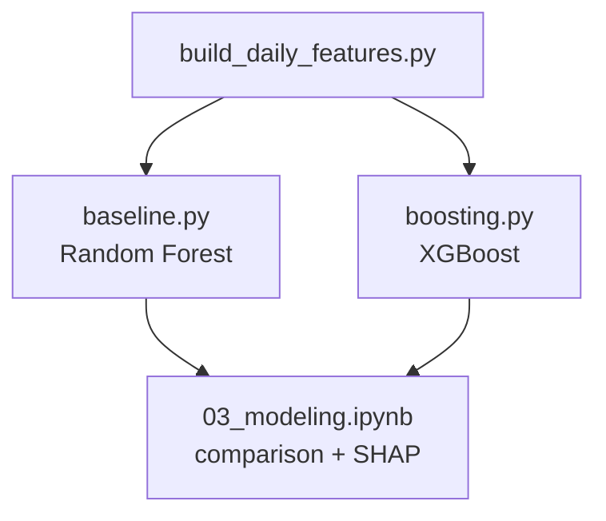

# Predictive Model Plan — TD Bank 5-Day Return

## Contents

- [1. Target Definition](#1-target-definition)
- [2. Included Data Sources](#2-included-data-sources)
- [3. Aggregation to Daily Grain](#3-aggregation-to-daily-grain)
- [4. NLP Feature Engineering](#4-nlp-feature-engineering)
- [5. Train / Test Split](#5-train--test-split)
- [6. Assumptions and Limitations](#6-assumptions-and-limitations)
- [7. Implementation Plan](#7-implementation-plan)

---

## 1. Target Definition

For every trading day `d`, the target is:

```
target[d] = (close[d+5] - close[d]) / close[d]
```

This is the **5-day forward return** of TD Bank (TD.TO): the percentage change between today's closing price and the closing price 5 trading days later (~1 calendar week).

### Concrete example

| Day `d` | TD close at `d` | TD close at `d+5` | target |
|---|---|---|---|
| Dec 4, 2024 | $77.20 | $74.50 | −3.5% |
| Dec 5, 2024 (consent order call) | $76.80 | $74.10 | −3.5% |
| Feb 26, 2025 (Q1'25 earnings eve) | $78.40 | $80.20 | +2.3% |

### Why 5 days, not 1 day

1-day returns are dominated by market microstructure noise (order flow, spread, intraday events). Our NLP features update once per quarter and capture **slow-moving narrative shifts**. A 5-day window is the shortest horizon where quarterly NLP features plausibly influence the return.

Concrete illustration: after the FY2024Q4 consent-order call (Dec 5, 2024), TD did not crash the next day — it drifted lower over the following 2–3 weeks. A 1-day model sees "CEO sentiment = 0.0 → next day nearly flat → NLP useless." A 5-day model captures the repricing.

### Why % return, not raw price

- Raw price is non-stationary: TD traded ~$55 in 2021 and ~$92 in 2026. A model trained on $55-range levels cannot generalise to $90+.
- % return is comparable across all years.
- Returns are what a trader cares about: "will holding TD for 5 days be profitable?"

### Dataset size after target construction

- ~1270 usable rows (trading days from Feb 25, 2021 — first NLP call date — to ~Apr 9, 2026, dropping the last 5 days where `d+5` is unknown)
- Each row = one trading day with its features and its 5-day forward return target

---

## 2. Included Data Sources

All sources are used up to their latest available date. There is no artificial cutoff at the FY2026Q1 call date (April 3, 2026) — price, macro, and news data after April 3 remain valid because FY2026Q1 NLP features forward-fill from that date. News data after FY2026Q1 is included in rolling window features.

| Source | File | Granularity | Last available |
|---|---|---|---|
| **TD price** | `data/raw/prices/TD_TO.parquet` | Daily | 2026-04-16 |
| **XFN** (financials sector ETF) | `data/raw/prices/XFN_TO.parquet` | Daily | 2026-04-16 |
| **GSPTSE** (TSX Composite) | `data/raw/prices/GSPTSE.parquet` | Daily | 2026-04-16 |
| **FX USD/CAD** | `data/raw/macro/fx_usdcad.parquet` | Daily | 2026-04-17 |
| **BoC overnight rate** | `data/raw/macro/overnight_avg.parquet` | Daily | 2026-04-16 |
| **GoC 2-year yield** | `data/raw/macro/goc_2y.parquet` | Daily | 2026-04-16 |
| **GoC 5-year yield** | `data/raw/macro/goc_5y.parquet` | Daily | 2026-04-16 |
| **GoC 10-year yield** | `data/raw/macro/goc_10y.parquet` | Daily | 2026-04-16 |
| **CPI** | `data/raw/macro/cpi_all_items.parquet` | Monthly → forward-fill | 2026-02-01 |
| **NLP features** (transcripts + filings) | `data/processed/features/nlp_features.parquet` | Quarterly → forward-fill from call date | FY2026Q1 (call: 2026-04-03) |
| **News annotations** | `data/processed/llm_annotations/news.jsonl` | Event-driven → rolling windows | 2026-04-16 |

**Excluded:**
- Individual peer prices (RY, BMO, BNS, CM, NA) — redundant with XFN which is the sector basket
- `policy_target_rate` — near-identical to `overnight_avg`
- Raw OHLC (open, high, low) — use `adj_close` only

---

## 3. Aggregation to Daily Grain

### 3.1 Price features (TD, XFN, GSPTSE)

| Feature | Formula | Purpose |
|---|---|---|
| `td_return_1d` | `(close[d] - close[d-1]) / close[d-1]` | Yesterday's momentum |
| `td_return_5d` | `(close[d] - close[d-5]) / close[d-5]` | 1-week momentum |
| `td_return_20d` | `(close[d] - close[d-20]) / close[d-20]` | 1-month momentum |
| `td_volatility_20d` | rolling 20-day std of `td_return_1d` | Risk regime |
| `td_volume_zscore_20d` | `(volume[d] - mean₂₀) / std₂₀` | Unusual trading activity |
| `td_vs_xfn_5d` | `td_return_5d - xfn_return_5d` | TD relative to financials sector |
| `td_vs_gsptse_5d` | `td_return_5d - gsptse_return_5d` | TD relative to broad market |
| `xfn_return_5d` | XFN 5-day return | Sector momentum |
| `gsptse_return_5d` | GSPTSE 5-day return | Broad market momentum |

### 3.2 FX (USD/CAD)

| Feature | Formula | Purpose |
|---|---|---|
| `fx_usdcad_level` | raw daily value | Exchange rate level |
| `fx_usdcad_return_5d` | 5-day % change | FX momentum |
| `fx_usdcad_volatility_20d` | rolling 20-day std of daily FX change | FX risk regime |

### 3.3 Interest rates and yields

| Feature | Formula | Purpose |
|---|---|---|
| `rate_overnight_level` | raw value | Current rate environment |
| `rate_overnight_change_5d` | `value[d] - value[d-5]` | Rate momentum |
| `yield_2y_level` | raw value | Short-rate expectations |
| `yield_5y_level` | raw value | Mortgage rate proxy |
| `yield_10y_level` | raw value | Long-end |
| `yield_curve_slope` | `yield_10y - yield_2y` | Curve steepness (key for bank NIM) |
| `yield_curve_slope_change_5d` | `slope[d] - slope[d-5]` | Curve momentum |

### 3.4 CPI — monthly, forward-fill to daily

| Feature | Formula | Purpose |
|---|---|---|
| `cpi_level` | latest known CPI value | Inflation level |
| `cpi_yoy_change` | `(cpi[d] - cpi[d-12m]) / cpi[d-12m]` | Year-over-year inflation |

### 3.5 NLP features — quarterly, project to daily via point-in-time

**Rule:** Use NLP features from the most recent earnings call date on or before day `d`. Forward-fill from call date to the next call date.

**Assumption:** The earnings call date is treated as the publication date for all disclosures in a quarter — transcript, quarterly supplemental report, and 40-F. Using the quarter end date as publication is not realistic (reports take weeks to finalise). The earnings call date is the earliest date at which all quarter-Q information is publicly available.

Earnings call dates derived from transcript data:

| Fiscal Quarter | Quarter ends | Call date (activation) |
|---|---|---|
| FY2021Q1 | 2021-01-31 | **2021-02-25** |
| FY2021Q2 | 2021-04-30 | **2021-05-27** |
| FY2021Q3 | 2021-07-31 | **2021-08-26** |
| FY2021Q4 | 2021-10-31 | **2021-12-02** |
| FY2022Q1 | 2022-01-31 | **2022-03-03** |
| FY2022Q2 | 2022-04-30 | **2022-05-26** |
| FY2022Q3 | 2022-07-31 | **2022-08-25** |
| FY2022Q4 | 2022-10-31 | **2022-12-01** |
| FY2023Q1 | 2023-01-31 | **2023-03-02** |
| FY2023Q2 | 2023-04-30 | **2023-05-26** |
| FY2023Q3 | 2023-07-31 | **2023-08-24** |
| FY2023Q4 | 2023-10-31 | **2023-11-30** |
| FY2024Q1 | 2024-01-31 | **2024-02-29** |
| FY2024Q2 | 2024-04-30 | **2024-05-23** |
| FY2024Q3 | 2024-07-31 | **2024-08-22** |
| FY2024Q4 | 2024-10-31 | **2024-12-05** |
| FY2025Q1 | 2025-01-31 | **2025-02-27** |
| FY2025Q2 | 2025-04-30 | **2025-05-22** |
| FY2025Q3 | 2025-07-31 | **2025-08-28** |
| FY2025Q4 | 2025-10-31 | **2025-12-04** |
| FY2026Q1 | 2026-01-31 | **2026-04-03** |

Days before the first call date (Feb 25, 2021) have no NLP features and are dropped from the model dataset.

### 3.6 News annotations — rolling daily windows

For each trading day `d`, compute generic rolling aggregates across **all** news chunks with `date <= d`. No topic pre-filtering — topic-level signal is already captured in NLP features (section 3.5). Cherry-picking topics like AML from news would introduce hindsight selection bias.

| Feature | Window | Purpose |
|---|---|---|
| `news_sent_mean_7d` | 7 days | Short-term news tone |
| `news_sent_mean_30d` | 30 days | Medium-term news tone |
| `news_count_7d` | 7 days | News activity level |
| `news_count_30d` | 30 days | News volume trend |
| `days_since_last_news` | — | News recency |

---

## 4. NLP Feature Engineering

Quarterly NLP features are constant for ~60 trading days between calls. Naive forward-fill produces flat features that tree models split on by date rather than signal content. Three transforms are applied to all 36 NLP source columns to encode information in useful ways.

**Guiding principle:** Apply transforms to **all** NLP columns uniformly — speaker sentiments, report sentiments, all 12 topic shares, all 12 topic sentiments, entropy, and derived framing gap. Do not pre-select columns based on Step 2 findings. Let SHAP determine importance post-hoc.

**NLP source columns (36 total):**
- Speaker: `ceo_prep`, `cfo_prep`, `exec_qa`, `analyst_qa` sentiment + `sentiment_std`
- Reports: `news_sentiment_mean`, `report_40f_sentiment_mean`, `report_quarterly_sentiment_mean`, `report_sentiment_mean`
- Topics (×12): `NIM`, `credit_quality`, `capital`, `US_retail`, `Canadian_personal`, `wealth_wholesale`, `regulatory_AML`, `macro_outlook`, `cost_efficiency`, `guidance`, `M_and_A`, `other` — each with `_share` and `_sentiment`
- `topic_entropy`
- Derived: `framing_gap` = `ceo_prep_sentiment - report_sentiment_mean`

### 4.1 Level (forward-fill)

Current state of each signal, constant within each inter-call window.

```
{col}_ffill  =  most recent quarter value, forward-filled from call date
```

### 4.2 Delta (publication shock)

Change from the prior quarter. Captures the magnitude of the shift at publication — e.g. CEO sentiment dropping sharply, a topic share spiking. Different constant per window.

```
{col}_delta  =  value[current quarter] − value[previous quarter]
```

### 4.3 Surprise (deviation from baseline)

How unusual is the current value relative to the trailing 4-quarter mean? Normalises across different baseline levels so the model can compare signals across columns.

```
{col}_surprise  =  value[current quarter] − mean(value, trailing 4 quarters)
```

### 4.4 Recency

| Feature | Formula |
|---|---|
| `days_since_call` | trading day `d` − most recent call date (resets to 0 on each new call) |

### 4.5 Event flags

| Feature | Definition |
|---|---|
| `is_earnings_week` | 1 if `days_since_call <= 5` |
| `is_news_burst` | 1 if `news_count_7d > 10` |

**Total NLP-derived features:** 36 columns × 3 transforms (level, delta, surprise) + 2 flags = **110 features**

---

## 5. Train / Test Split

### Why time-based split, not random k-fold

Financial time-series data has two properties that make random splitting invalid:

1. **Temporal ordering**: the model must only use information available at the time of prediction. A random split would put future observations in the training set — this is look-ahead leakage.
2. **Overlapping targets**: consecutive 5-day forward returns share 4 of the same future prices (days `d` and `d+1` both reference closes at `d+2`, `d+3`, `d+4`, `d+5`, `d+6`). A random split that puts `d` in training and `d+1` in test effectively leaks the target.

### Split design

```
Training set:  Feb 25, 2021  →  Dec 31, 2024   (~980 rows, ~77%)
Test set:      Jan 1,  2025  →  Apr 9,  2026   (~290 rows, ~23%)
```

**Why this cutoff:**
- The cutoff falls after FY2024Q4 (Dec 5, 2024 call) — the consent-order quarter that is the most dramatic event in the dataset.
- The test set covers 5 full quarters (FY2025Q1–FY2026Q1), providing meaningful out-of-sample NLP regime shifts (the recovery period).
- The model trains on the build-up and crisis, then is evaluated on the recovery — a realistic evaluation of whether the NLP signals generalize.

### Visualised split

```
|-------- Training (2021–2024) --------|--- Test (2025–2026) ---|
Feb 2021                          Dec 2024 Jan 2025         Apr 2026
    [NLP: FY2021Q1 → FY2024Q4]              [NLP: FY2025Q1 → FY2026Q1]
```

### No cross-validation for MVP

Expanding-window or purged cross-validation would be more rigorous but adds implementation complexity. For MVP, a single sequential split is sufficient. The test set covers a qualitatively different market regime (post-crisis recovery) which provides a genuine generalisation test. Mention in notebook that CV is a future improvement.

---

## 6. Assumptions and Limitations

- **Real-time pipeline assumption**: The model assumes an end-of-day pipeline exists — collecting today's news, closing prices, and macro data, then running inference to produce the 5-day forward prediction. This analysis uses a static historical dataset and does not implement live inference. Building such a pipeline would require integration with live data vendors.

- **Small NLP sample**: only 21 quarterly NLP snapshots across 5 years. The model sees only ~21 distinct NLP regime values per column. SHAP feature attribution is more informative than point predictions here.

- **No intra-quarter NLP updates**: between earnings calls, all NLP level features are constant (~60 trading days). News rolling features partially compensate.

- **Report date approximation**: Quarterly reports and 40-F filings are stored with quarter end dates, which is not realistic. We use the earnings call date as the uniform publication date for all disclosures (transcript, quarterly report, 40-F). This is the earliest date at which all quarter information is publicly available.

- **CPI lag**: CPI for month M is released mid-month M+1. We forward-fill from the first of the month as a proxy, slightly overstating availability.

- **Overlapping target autocorrelation**: consecutive 5-day returns share 4 days of the same future window. A single time-based split avoids leakage but does not eliminate autocorrelation in residuals. Reported metrics (R², directional accuracy) should be interpreted conservatively.

- **No transaction costs**: model evaluates return predictability only, not a live trading strategy. Positive accuracy does not imply tradeable alpha after costs.

---

## 7. Implementation Plan

### Files to build

| File | Purpose |
|---|---|
| `src/features/build_daily_features.py` | Join all sources; apply all transforms; output `data/processed/features/model_features_daily.parquet` |
| `src/models/baseline.py` | Random Forest with time-based train/test split |
| `src/models/boosting.py` | XGBoost with same split + SHAP feature importance |
| `notebooks/03_modeling.ipynb` | Model comparison, SHAP plots, backtest narrative |

### Build order



### Output dataset shape

- Rows: ~1270 trading days
- Features: ~9 price + ~8 macro + ~110 NLP-engineered + ~5 news rolling = **~132 features**
- Target: `td_return_5d_fwd` (continuous, regression)
- Train rows: ~980 | Test rows: ~290
